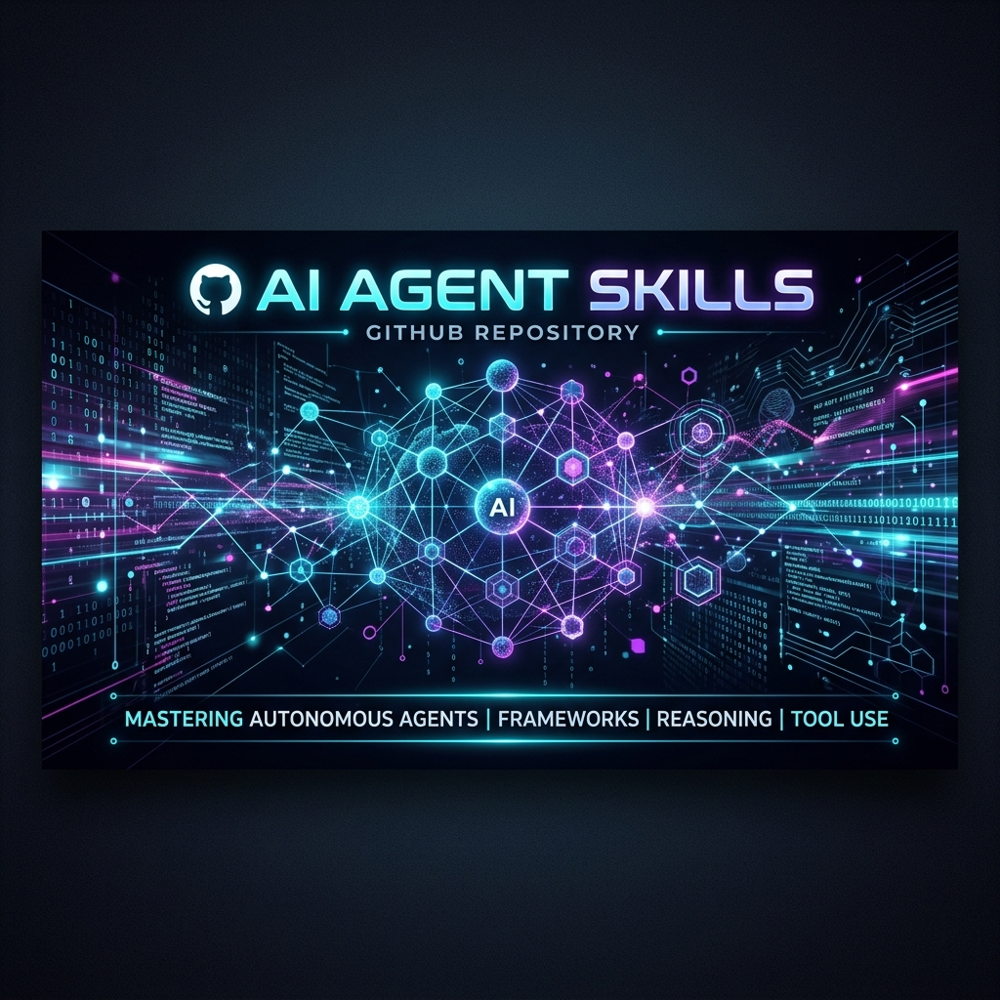

<div align="center">
  

  # 🤖 AI Agent Skills & Capabilities Repository

  **The Ultimate Collection of Production-Grade AI Agent Skills, Tools, and Engineering Frameworks.**

  [](LICENSE)
  [](http://makeapullrequest.com)
  [](https://GitHub.com/Shivay00001/ai-agent-skills/graphs/commit-activity)
  []()
</div>

<br />

## 📖 About This Repository

Welcome to the **AI Agent Skills** repository! This is a comprehensive, production-ready collection of AI agent skills, workflows, system prompts, and engineering tools designed to empower autonomous agents with deep expertise. 

Whether you are building LLM-powered applications, configuring multi-agent systems, or integrating advanced capabilities (like automated DevOps, GitHub management, data engineering, and code reviews) into your workflow, this repository provides the standard operating procedures and "brain" needed to achieve elite engineering intelligence.

### 🌟 Key Features
- **Plug-and-Play Skills**: Ready-to-use markdown skill files (`SKILL.md`) for instant context loading.
- **Multi-Domain Expertise**: Covers DevOps, Data Engineering (BigQuery, GCP, Dataflow), Full-Stack Development, Security, and more.
- **Agentic Frameworks**: Includes tools for autonomous multi-agent engineering and adaptive system operations.
- **Production-Ready**: Built following the best standards of top tech companies for reliability and scale.

---

## 🛠️ Skills Directory

Here is an overview of some of the powerful skills included in this repository:

| Category | Skill | Description |
|----------|-------|-------------|
| **Engineering & DevOps** | `devops-checklist` | Comprehensive DevOps & Engineering Master Skills Reference. |
| | `github-management` | Automates GitHub PRs, issues, and repository setup. |
| | `autonomous-multi-agent-engineering` | Architecture for coordinating multi-agent software teams. |
| **Data & Cloud (GCP)** | `bigquery-ai-ml` | Advanced data analytics, GenAI, and forecasting in BigQuery. |
| | `gcp-data-pipelines` | Best practices for building/orchestrating data pipelines on Google Cloud. |
| | `google-cloud-storage-basics` | GCS management, streaming, and architecture patterns. |
| **Code & Architecture** | `uaaf-full` & `uaaf-lean` | Universal App Architect Frameworks for building scalable apps. |
| | `code-review` | Context-aware, automated code reviews for AI agents. |
| | `safe-coding-practices` | Strategies for safe, non-breaking code modifications. |
| | `codebase-flow-diagrams` | Generates flow diagrams & deep code explanations with real-life analogies. |
| **Specialized Workflows**| `scrapegraph-ai` | AI-powered web scraping pipelines. |
| | `omnichannel-promotion` | SEO/AEO optimization and omnichannel marketing strategies. |
| | `watermarks-remover` | Tooling for AI provenance mark cleaning and management. |

*(Explore the full list of 175+ skills in the root directories!)*

---

## 🚀 How to Use These Skills

These skills are structured as markdown files containing context, rules, and best practices. To use them with your AI agent (like Antigravity, Goose, or custom LLM frameworks):

1. **Clone the Repository**:
   ```bash
   git clone https://github.com/Shivay00001/ai-agent-skills.git
   ```
2. **Mount to Agent**:
   Load the relevant `SKILL.md` into your agent's context window or system prompt before starting a specialized task.
3. **Execute**:
   The agent will now follow the structured workflow, security constraints, and best practices defined in the skill!

---

## 🤝 Contributing

We welcome contributions! If you have developed a powerful new skill, agent framework, or prompt engineering pattern, please submit a Pull Request. Let's build the ultimate standard for AI engineering together.

## 📄 License

This repository is licensed under the MIT License - see the LICENSE file for details.

---
<div align="center">
  <i>Built with 💡 for the future of AI Engineering.</i>
</div>
