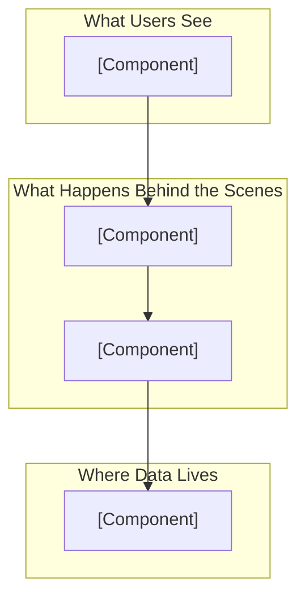
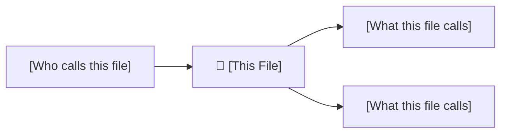
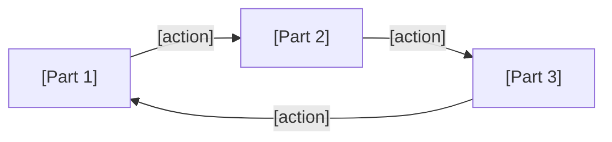

# 📖 [PROJECT_NAME] — Complete Codebase Explained

> Everything you need to understand this project, explained in plain English.
> **Last Updated:** [DATE]
> **Reading Time:** ~[X] minutes
> **Generated by:** codebase-flow-diagrams skill

---

## Table of Contents

1. [What Is This Project?](#what-is-this-project)
2. [Who Is It For?](#who-is-it-for)
3. [The Big Picture (30-Second Version)](#the-big-picture)
4. [Tech Stack Explained](#tech-stack-explained)
5. [Project Structure Map](#project-structure-map)
6. [A Day in the Life (Story Mode)](#a-day-in-the-life)
7. [Every File Explained](#every-file-explained)
8. [Core Features Deep Dive](#core-features-deep-dive)
9. [Patterns & Architecture Explained](#patterns--architecture-explained)
10. [What Happens When... (Scenarios)](#what-happens-when-scenarios)
11. [Glossary](#glossary)
12. [Common Questions](#common-questions)

---

## What Is This Project?

### 🟢 Beginner — "Explain Like I'm 5"

<!-- Use ONLY everyday words. No technical terms. Pure analogy. -->

> Imagine [ANALOGY_THAT_EXPLAINS_THE_ENTIRE_PROJECT].
> This project is basically [SIMPLE_DESCRIPTION].

### 🟡 Intermediate — "I Know Some Coding"

<!-- Introduce basic technical terms, but define each one. -->

[PROJECT_NAME] is a [TYPE_OF_APPLICATION] built with [FRAMEWORK].
It allows users to [CORE_FUNCTIONALITY].

Under the hood, it uses:
- **[Technology]** — [What it does in one line] (think of it like [ANALOGY])
- **[Technology]** — [What it does in one line] (think of it like [ANALOGY])

### 🔴 Advanced — "Give Me the Full Picture"

<!-- Full technical description with architecture decisions. -->

[DETAILED_TECHNICAL_DESCRIPTION including architecture pattern,
communication protocols, data persistence strategy, deployment model,
and key design decisions with their rationale.]

---

## Who Is It For?

| User Type | What They Do | Example |
|-----------|-------------|---------|
| [User Type 1] | [Their primary action] | [Concrete example] |
| [User Type 2] | [Their primary action] | [Concrete example] |

---

## The Big Picture

### 30-Second Version

> If you only read one paragraph, read this:
>
> [PROJECT_NAME] is [WHAT_IT_IS]. When a user [COMMON_ACTION], the system
> [WHAT_HAPPENS_INTERNALLY], and the user sees [WHAT_THEY_SEE].
> The whole thing runs on [INFRASTRUCTURE_SUMMARY].

### 🏠 Real-Life Analogy

> **The entire system is like a [ANALOGY].**
>
> [EXPANDED_ANALOGY mapping each major component to a real-world equivalent.
> For example: "This app is like a restaurant. The frontend is the dining
> room where customers sit. The API is the waiter who takes orders. The
> backend is the kitchen where the food is prepared. The database is the
> pantry where all the ingredients are stored."]

### Visual Overview



---

## Tech Stack Explained

> Every technology used in this project, explained so anyone can understand.

### [Technology Name, e.g., "React"]

| | |
|---|---|
| **What is it?** | [Simple definition] |
| **🏠 Analogy** | [Real-life comparison] |
| **Why we use it** | [What problem it solves] |
| **Where it's used** | [Which parts of the project] |
| **Alternatives** | [Other options we could have used] |
| **Why not alternatives** | [Why this was chosen over others] |

<!-- Repeat for each technology -->

---

## Project Structure Map

> Think of this like a building floor plan — each folder is a "room" with a specific purpose.

```
project-root/
│
├── 📁 src/                        # 🏠 "The Building" — All source code lives here
│   │
│   ├── 📁 components/             # 🧱 "Building Blocks" — Reusable UI pieces
│   │   │                          #    Like LEGO bricks you snap together
│   │   ├── 📄 Header.jsx          # The top bar you see on every page
│   │   ├── 📄 Button.jsx          # A reusable button (so we don't rebuild
│   │   │                          #    buttons from scratch everywhere)
│   │   └── ...
│   │
│   ├── 📁 pages/                  # 📄 "Rooms" — Each page the user visits
│   │   │                          #    Like different rooms in a house
│   │   ├── 📄 HomePage.jsx        # What you see when you first arrive
│   │   ├── 📄 LoginPage.jsx       # Where you prove who you are
│   │   └── ...
│   │
│   ├── 📁 services/               # ⚙️ "The Engine Room" — Business logic
│   │   │                          #    Like the kitchen in a restaurant
│   │   └── ...
│   │
│   ├── 📁 utils/                  # 🔧 "Toolbox" — Helper functions
│   │   │                          #    Like a Swiss Army knife of small tools
│   │   └── ...
│   │
│   └── 📁 config/                 # ⚙️ "Settings Panel" — App configuration
│                                  #    Like the thermostat & light switches
│
├── 📁 tests/                      # 🧪 "Quality Control" — Automated checks
│                                  #    Like taste-testing food before serving
│
├── 📄 package.json                # 📋 "Shopping List" — All dependencies
│                                  #    Lists everything the project needs
│
└── 📄 README.md                   # 📖 "Welcome Sign" — Project introduction
```

---

## A Day in the Life

> Let's follow a real user through the app to see how everything works together.

### 📖 Story 1: [Common Action, e.g., "A New User Signs Up"]

Imagine you're **[User Persona]**. You've just heard about [APP_NAME] and
want to try it out. Here's what happens, step by step:

---

#### Chapter 1: Opening the Front Door

**What you do:** You type `[URL]` in your browser and hit Enter.

**What happens behind the scenes:**

> 🏠 **Analogy:** This is like walking up to a restaurant and opening the
> front door. The restaurant (server) sees you coming and hands you a menu
> (the HTML page).

1. Your browser sends a request to the server: *"Hey, give me the homepage!"*
2. The server responds with `index.html` — this is the skeleton of the page
3. The browser reads `index.html` and sees it needs more files (CSS for
   styling, JS for interactivity) — like the skeleton needing muscles and skin
4. Those files are loaded, and the app comes alive on your screen

**Files involved:**
- [index.html](file:///path) — The skeleton
- [App.jsx](file:///path) — The brain that decides what to show
- [index.css](file:///path) — The clothing (visual styling)

---

#### Chapter 2: [Next Step]

**What you do:** [User action]

**What happens behind the scenes:**

> 🏠 **Analogy:** [Analogy for this step]

[Detailed step-by-step trace through the code]

**Files involved:**
- [file](file:///path) — [Purpose]

---

<!-- Continue with more chapters for the complete user journey -->

### 📖 Story 2: [Another Common Action]

<!-- Repeat the story format for other key user journeys -->

---

## Every File Explained

> Below is a detailed explanation of every important file in this project.
> Files are grouped by their "department" (directory).

---

### 📁 [Directory Name] — "[Analogy Name]"

> [1-2 sentence description of what this directory is responsible for]
>
> 🏠 **Analogy:** [How this directory relates to real life]

---

### 📄 [filename] — [One-Line Purpose]

**📍 Location:** `path/to/file`
**🎯 Purpose:** [What this file does in 1-2 sentences]
**🤔 Why it exists:** [What problem would arise without it]

🏠 **Real-Life Analogy:**
> [Analogy that makes the purpose instantly clear]

#### What's Inside (Plain English)

[Walk through the file's contents as a story — what happens first,
what happens next, why each piece matters. Write as if narrating
a documentary.]

#### Key Functions / Classes Explained

| Name | What It Does (Plain English) | Real-Life Equivalent |
|------|------------------------------|---------------------|
| `functionA()` | [Simple explanation] | Like [analogy] |
| `functionB()` | [Simple explanation] | Like [analogy] |
| `ClassC` | [Simple explanation] | Like [analogy] |

#### How It Connects to Other Parts



**In plain English:**
- **Called by:** [File X] uses this when [situation]
- **Calls:** This file reaches out to [File Y] to [purpose]

#### Walk-Through Example

> Let's trace what happens when [specific scenario]:

```
Step 1: [What triggers this file]
   ↓
Step 2: [functionA()] runs → [what it does]
   ↓
Step 3: [functionB()] runs → [what it does]
   ↓
Step 4: Result is [what comes out]
```

<!-- Repeat for every important file -->

---

## Core Features Deep Dive

> Each major feature explained from "why does this exist?" to
> "here's every line of code and what it does."

---

### 🔬 Deep Dive: [Feature Name]

#### The Problem

**In real life:** [Describe the real-world problem this feature solves
using everyday language]

**In this app:** [How the problem manifests in the application context]

#### The Solution (No-Code Version)

> 🏠 **Analogy:** [Explain the entire solution using only a real-life analogy]
>
> [Expanded analogy covering the key steps]

#### The Solution (With Code)

Let's look at the actual code that makes this work:

```[language]
// 📌 [filename]:L[line] — [What this code does]

// Step 1: [Purpose of this block]
// (🏠 Like [analogy for this step])
[actual code from the codebase]

// Step 2: [Purpose of this block]
// (🏠 Like [analogy for this step])
[actual code from the codebase]
```

#### Step-by-Step Trace

> Following a [action] from start to finish:

| Step | What Happens | Where (File:Line) | 🏠 Analogy |
|------|-------------|-------------------|-----------|
| 1 | [Action] | `file.js:L42` | Like [analogy] |
| 2 | [Action] | `file.js:L58` | Like [analogy] |
| 3 | [Action] | `service.js:L12` | Like [analogy] |
| ... | ... | ... | ... |

#### What Could Go Wrong?

| What Fails | Why It Happens | What User Sees | How Code Handles It | 🏠 Analogy |
|---|---|---|---|---|
| [Failure] | [Cause] | [User experience] | [Code response] | Like [analogy] |

#### Three-Level Explanation

**🟢 Beginner:** [2-3 sentence explanation using only analogies]

**🟡 Intermediate:** [Technical explanation with defined terms]

**🔴 Advanced:** [Full architectural detail with trade-offs]

#### Common Questions

**Q: Why don't we just [simpler alternative]?**
A: [Honest explanation of the trade-off, using an analogy]

**Q: What happens if [edge case]?**
A: [Clear explanation with code reference]

---

<!-- Repeat Deep Dive for each major feature -->

---

## Patterns & Architecture Explained

> Design patterns are like recipes — proven solutions to common problems.
> Here are the patterns used in this codebase.

---

### 🧩 Pattern: [Pattern Name, e.g., "MVC"]

**What is it?**
[1-2 sentence definition]

🏠 **Real-Life Analogy:**
> [Analogy that makes the pattern click]

**Why this project uses it:**
[What specific problem it solves here]

**Where to find it:**

| Role in Pattern | File(s) | What It Does |
|----------------|---------|-------------|
| [Role, e.g., "Model"] | [file path] | [Purpose] |
| [Role, e.g., "View"] | [file path] | [Purpose] |
| [Role, e.g., "Controller"] | [file path] | [Purpose] |

**How it flows:**



**Pros & Cons (honest assessment):**

| ✅ Pros | ⚠️ Cons |
|---------|---------|
| [Benefit] | [Drawback] |

---

<!-- Repeat for each pattern -->

---

## What Happens When... (Scenarios)

> Real-world scenarios explained step by step — including what could go wrong.

---

### ❓ What happens when a user submits a form with invalid data?

🏠 **Analogy:** It's like submitting a job application with missing fields —
the reception desk (frontend validation) catches obvious problems before it
even reaches HR (the server).

**The journey:**

```
User types invalid email
    ↓
📱 Frontend Validation (instant feedback)
    → [file.jsx:L30] checks email format
    → Shows red error message under the field
    → Form CANNOT be submitted yet
    ↓
User fixes email, submits
    ↓
📡 Request hits the server
    ↓
🔒 Server Validation (second check)
    → [validator.js:L15] re-validates everything
    → Why? Because someone could bypass the frontend
    → (🏠 Like how a bank verifies your ID even though
       security already checked you at the door)
    ↓
✅ All valid → proceed with saving
```

---

### ❓ What happens when the database goes down?

<!-- Detailed scenario walkthrough -->

---

### ❓ What happens when 1,000 users hit the app simultaneously?

<!-- Detailed scenario walkthrough -->

---

### ❓ What happens when someone tries to access a page without logging in?

<!-- Detailed scenario walkthrough -->

---

### ❓ What happens when a new version is deployed?

<!-- Detailed scenario walkthrough -->

---

## Glossary

> Every technical term used in this project, explained so anyone can understand.

| Term | Plain English | 🏠 Analogy | Used In |
|------|--------------|-----------|---------|
| **API** | A way for programs to talk to each other | Like a waiter taking orders between you and the kitchen | `src/routes/` |
| **Component** | A reusable piece of the user interface | Like a LEGO brick — build once, use everywhere | `src/components/` |
| **Middleware** | Code that runs between receiving a request and processing it | Like airport security between check-in and your gate | `src/middleware/` |
| **State** | Data that changes over time and affects what the user sees | Like a scoreboard that updates during a game | `src/store/` |
| **Route** | A URL path that maps to a specific page or action | Like a street address that tells you where to go | `src/routes/` |
| **Hook** | A way to add behavior to components (React-specific) | Like attaching a tool to your belt — grab it when needed | `src/hooks/` |
| **Schema** | A blueprint defining the structure of data | Like a form template — it defines what fields exist | `src/models/` |
| **Token** | A digital "pass" that proves you're logged in | Like a movie ticket — show it to get in, expires after the show | Auth system |
| **Environment Variable** | A secret setting stored outside the code | Like a combination lock code written on a note in the manager's safe | `.env` |

---

## Common Questions

### "Where do I start reading the code?"

Start here, in this order:
1. **[Entry file]** — This is where everything begins
2. **[Main config]** — This tells you how the app is configured
3. **[Core feature file]** — This shows the main thing the app does

### "How do I add a new feature?"

1. [Step-by-step guide referencing the patterns above]

### "How do I run this project locally?"

```bash
# Step 1: [Description]
[command]

# Step 2: [Description]
[command]
```

### "What's the most important file in this project?"

[File] — because [reason]. Everything else revolves around it.

---

## Changelog

| Date | What Changed | Why |
|------|-------------|-----|
| [DATE] | Initial generation | First documentation |
