# 🔀 Flow Diagrams — [PROJECT_NAME]

> Auto-generated flow documentation  
> **Last Updated:** [DATE]  
> **Tech Stack:** [STACK]  
> **Total Diagrams:** [COUNT]  
> **Generated by:** codebase-flow-diagrams skill

---

## Table of Contents

- [System Architecture Overview](#system-architecture-overview)
- [Directory & Module Structure](#directory--module-structure)
- [Component Dependencies](#component-dependencies)
- [Request/Response Flows](#requestresponse-flows)
- [Data Flows](#data-flows)
- [State Machines](#state-machines)
- [Entity Relationships](#entity-relationships)
- [Authentication & Authorization](#authentication--authorization)
- [Error Handling](#error-handling)
- [Deployment & Infrastructure](#deployment--infrastructure)
- [Event / Message Flows](#event--message-flows)
- [Feature Flows](#feature-flows)
- [Class Hierarchies](#class-hierarchies)
- [CI/CD Pipeline](#cicd-pipeline)
- [Third-Party Integrations](#third-party-integrations)
- [Glossary](#glossary)
- [Legend](#legend)
- [Changelog](#changelog)

---

## System Architecture Overview

<!-- 
  Describe the system at the highest level.
  Show all major subsystems and how they connect.
-->

[2-4 sentence explanation of what this diagram shows]

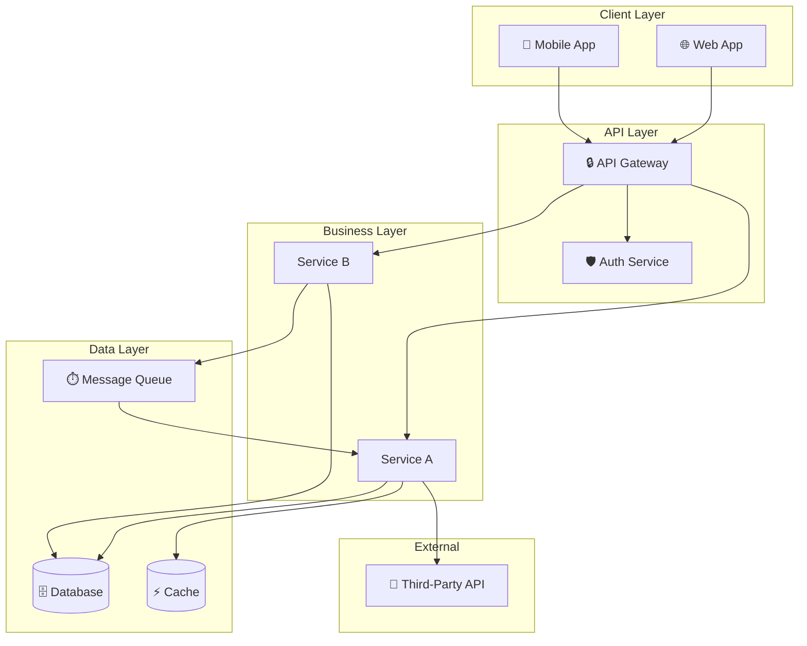

**Key Files:**
- [entry-point](file:///path/to/entry)
- [config](file:///path/to/config)

---

## Directory & Module Structure

<!-- Map the project's organizational structure -->

[Explanation of how the project is organized]

```
project-root/
├── src/                    # Source code
│   ├── components/         # UI Components
│   ├── services/           # Business logic
│   ├── models/             # Data models / entities
│   ├── routes/             # API route definitions
│   ├── middleware/          # Request middleware
│   ├── utils/              # Shared utilities
│   └── config/             # Configuration
├── tests/                  # Test suites
├── docs/                   # Documentation
├── scripts/                # Build/deploy scripts
└── infra/                  # Infrastructure-as-code
```

---

## Component Dependencies

<!-- Show which modules depend on which -->

[Explanation of dependency direction and coupling]

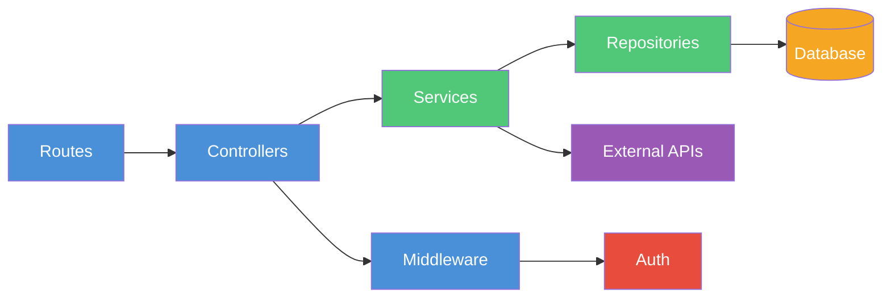

**Key Files:**
- [dependency-config](file:///path/to/deps)

---

## Request/Response Flows

### [Feature Name] — [HTTP Method] [Endpoint]

[Explain what this flow does and when it triggers]

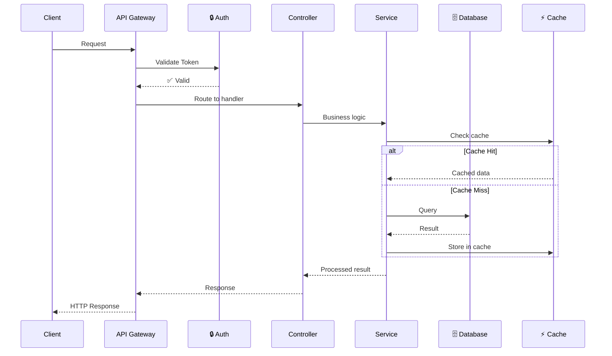

**Key Files:**
- [route-definition](file:///path/to/route)
- [controller](file:///path/to/controller)
- [service](file:///path/to/service)

---

## Data Flows

<!-- Show how data moves through the system -->

[Explanation of data lifecycle]

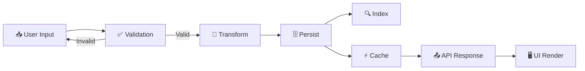

---

## State Machines

### [Entity Name] Lifecycle

[Explain the states and transitions for this entity]

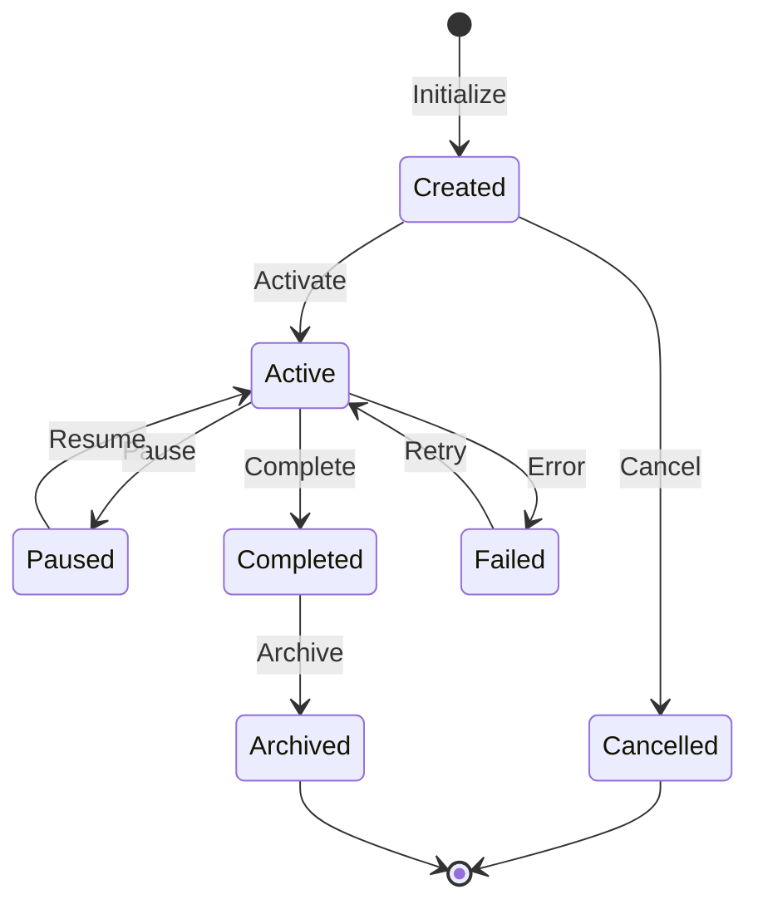

**Key Files:**
- [state-machine](file:///path/to/state-machine)

---

## Entity Relationships

<!-- Map database entities and their relationships -->

[Explanation of data model]

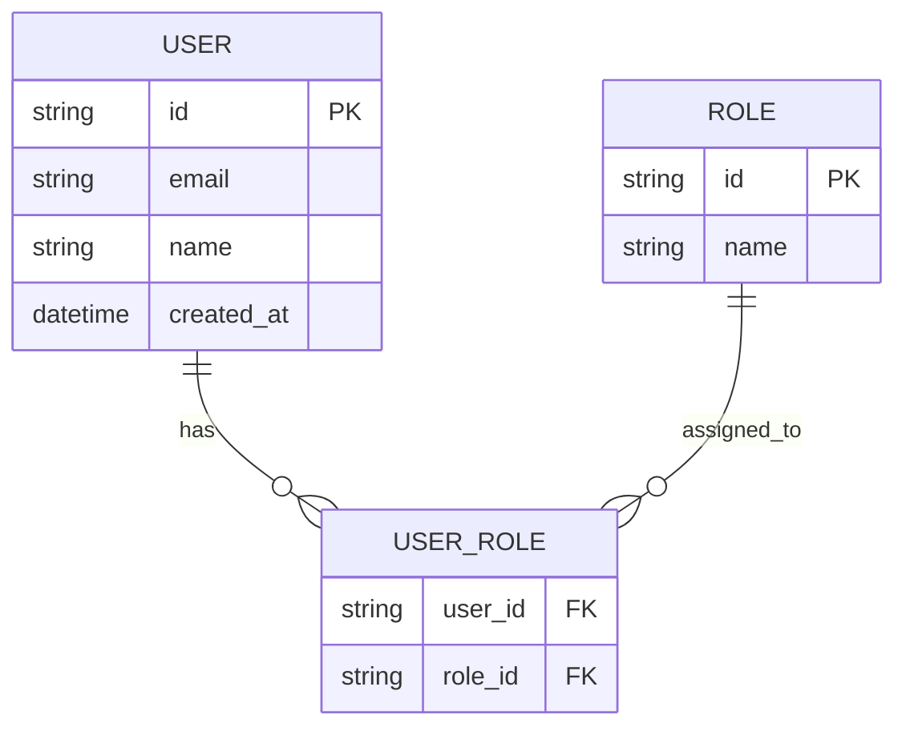

---

## Authentication & Authorization

[Explanation of the auth architecture]

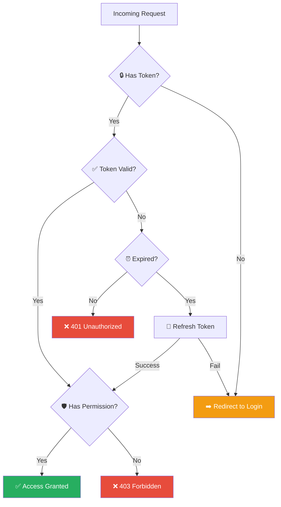

---

## Error Handling

[Explanation of error handling strategy]

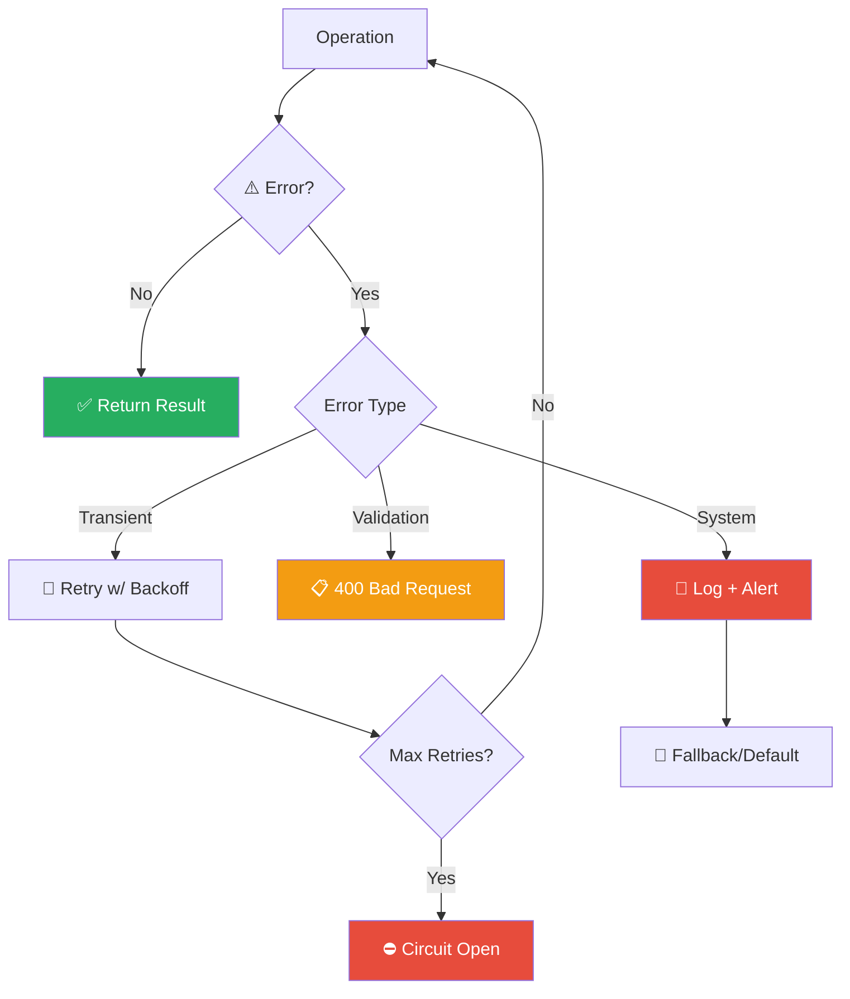

---

## Deployment & Infrastructure

[Explanation of deployment architecture]

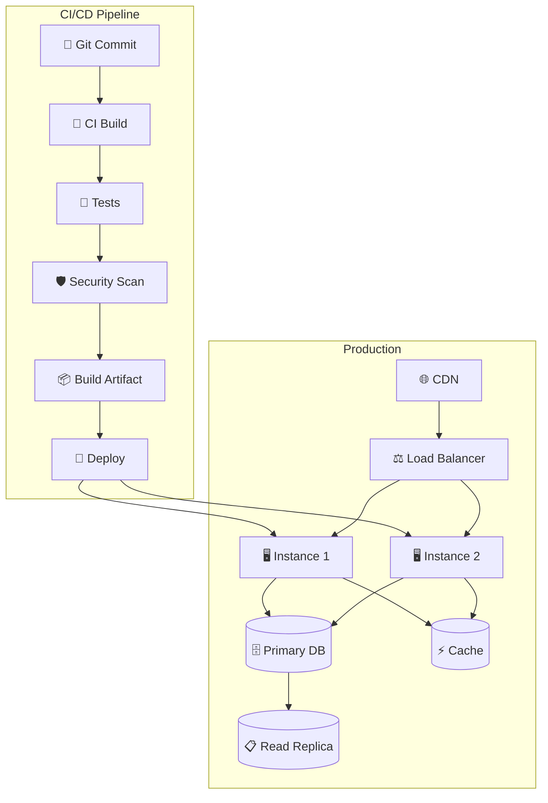

---

## Event / Message Flows

[Explanation of async/event-driven patterns]

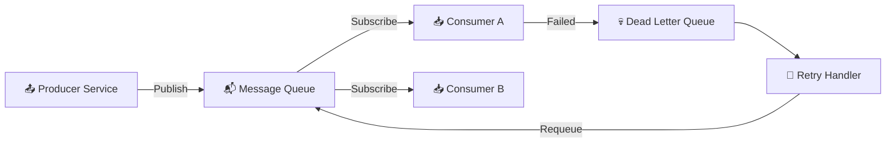

---

## Feature Flows

### [Feature Name]

[Explain the complete user journey for this feature]

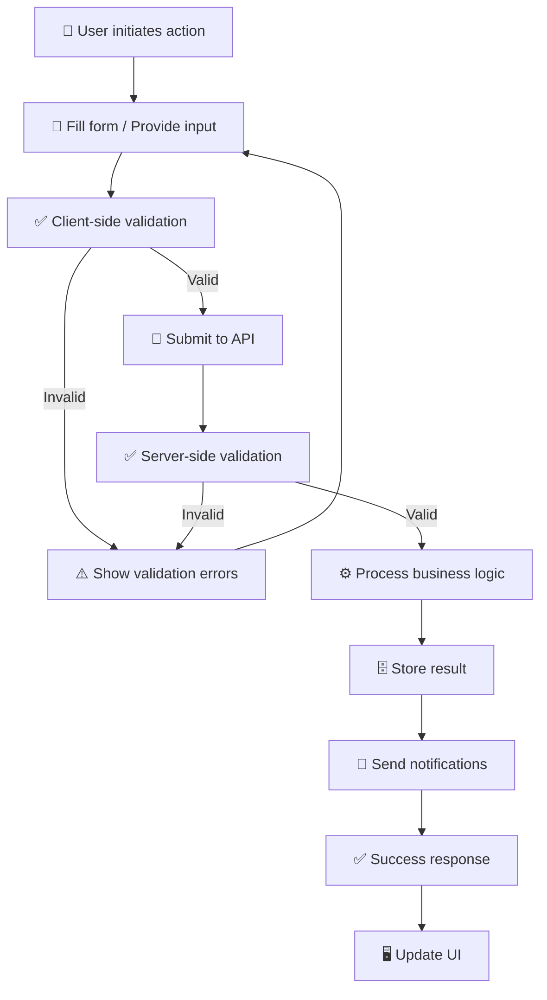

---

## Class Hierarchies

[Explanation of class/interface structure]

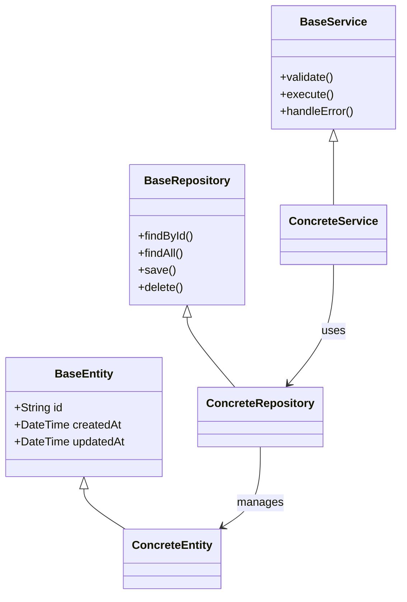

---

## CI/CD Pipeline

[Explanation of build and deployment pipeline]

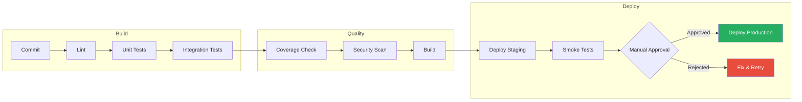

---

## Third-Party Integrations

[Explanation of external service dependencies]

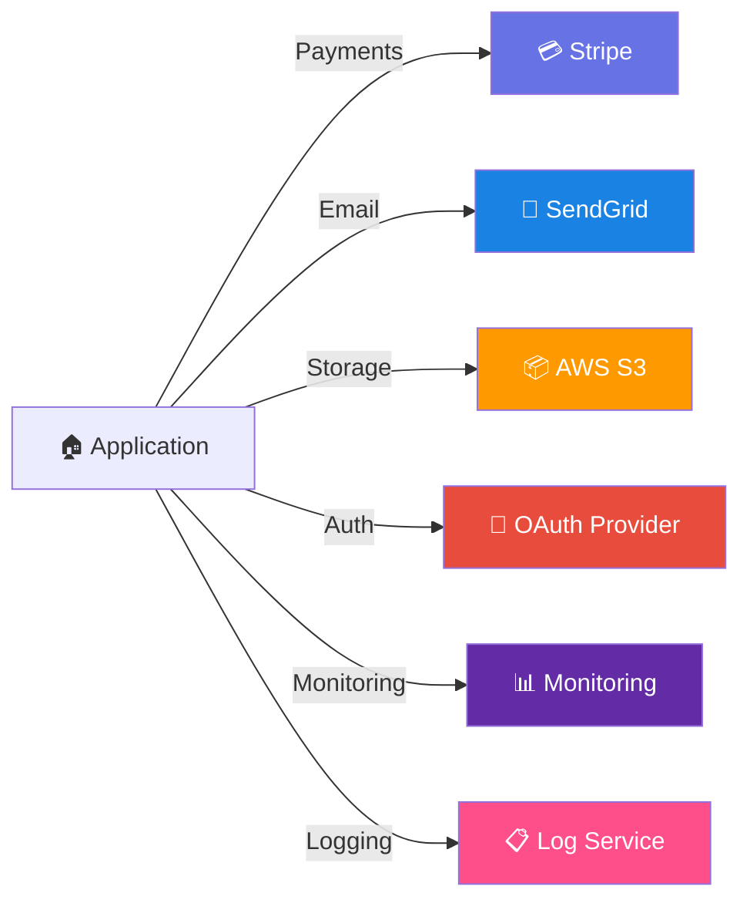

---

## Glossary

| Term | Definition |
|------|-----------|
| [TERM] | [DEFINITION] |

---

## Legend

| Element | Meaning |
|---------|---------|
| 🔒 | Auth-protected endpoint or service |
| ⚡ | Performance-critical / cached |
| 🛡️ | Security boundary |
| 📦 | External package or service |
| 🗄️ | Database operation |
| 📡 | Network / HTTP call |
| ⏱️ | Async / queued operation |
| 🔄 | Retry logic |
| ⚠️ | Error / warning path |
| Blue nodes | Frontend / Client layer |
| Green nodes | Backend / Business layer |
| Orange nodes | Data / Storage layer |
| Purple nodes | External / Third-party |
| Red nodes | Security / Error paths |

---

## Changelog

| Date | Section | Change | Reason |
|------|---------|--------|--------|
| [DATE] | All | Initial generation | First documentation |
